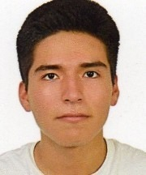

# Grupo4_RPatrones_2025_I

## ¿Quiénes somos?
| Foto | Presentación | 
|----------|----------|
|      | **Christian Andre Ayala Pichilingue**  *christian.ayala@upch.pe*  Hola, soy Christian y estoy interesado en la biomecánica y la rehabilitación estoy trabajando como asistente de investigación en el Laboratorio de Ingeniería Biomecánica y Robótica Aplicada(LIBRA) en la PUCP.  |
|      | **ALeonardo Nicolas Zuñiga**  *leonardo.zuniga@upch.pe*  ¡Hola! Soy Leonardo, estudiante de pregrado de Ingeniería Biomédica. El motivo porque el que elegi la carrera es por los problemas existentes en el sector salud del país. Asimismo, me interesa mucho las diferentes herramientas que se pueden utilizar para mejorar la situación del país y la calidad de vida de las personas más necesitadas.  |
|      | **Italo Alexander Acuña Salas**  *italo.acuna@upch.pe*  Hola, soy Italo, estudiante de pregrado de Ingeniería Biomédica del 9no ciclo. Mi razón de estudiar Ingeniería Biomédica es por mi interés en el uso de la tecnología e ingeniería en el campo de la medicina y la posibilidad de aportar en mejorar y salvar la vida de las personas. Estoy especialmente interesado en el ámbito de las imágenes médicas y las mejoras de diagnóstico, así como la reparación y mantenimiento de los equipos de imágenes.|
